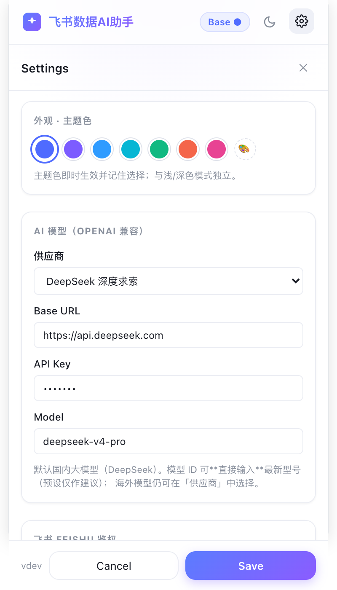
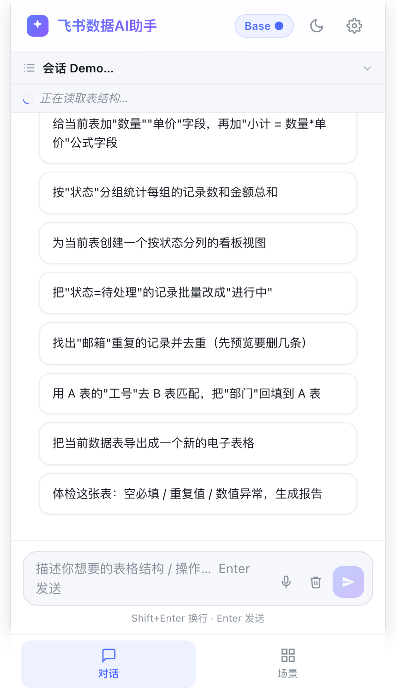
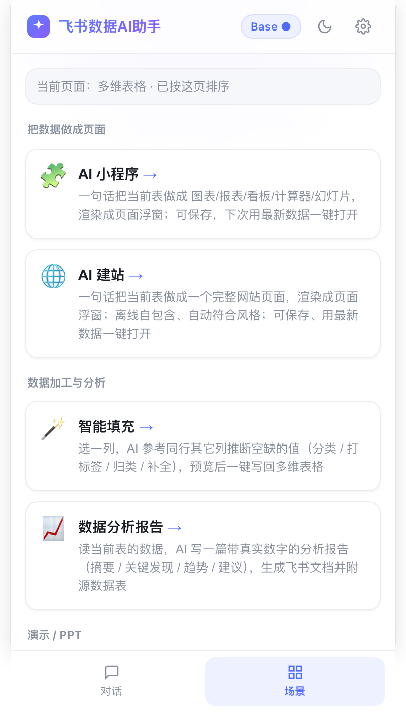
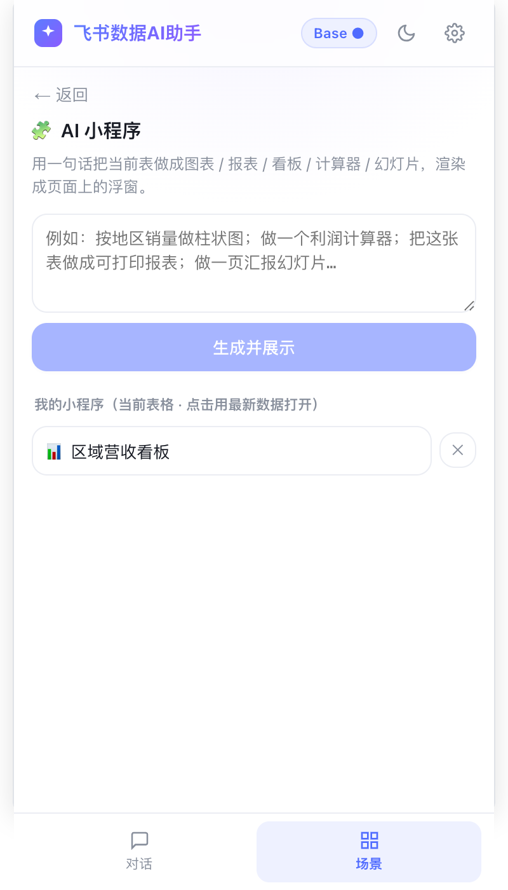
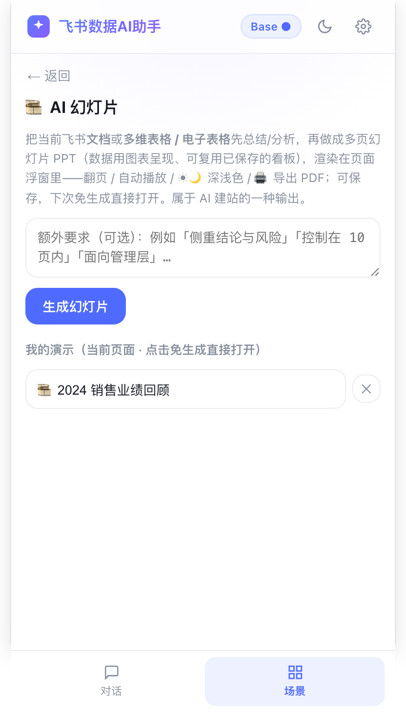
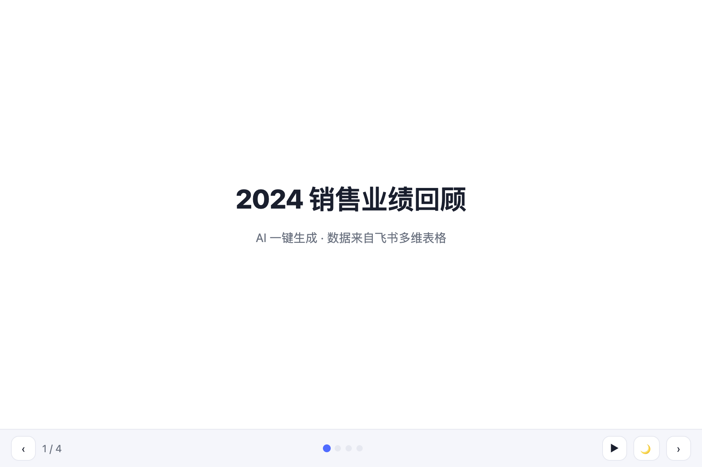
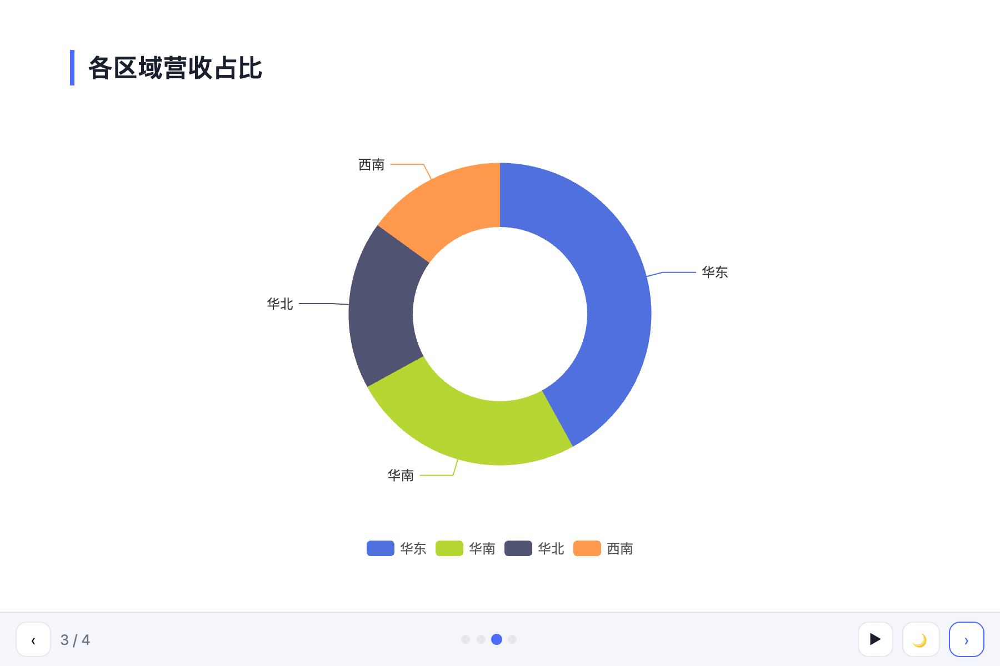
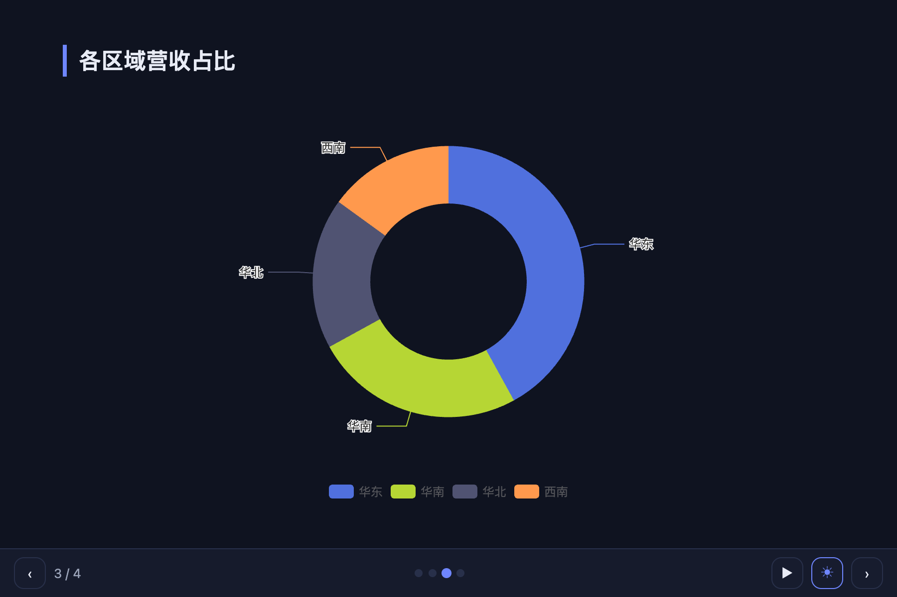

# Lumen · 功能使用手册

> Chrome 侧边栏扩展：在飞书**多维表格 / 电子表格 / 文档**页面用一句话让 AI 帮你建表、填数、写文档、做看板、做 PPT。无后端，全部以你本人身份操作。
>
> 截图取自 `npm run dev:ui` 内置预览，与实际侧边栏一致。

---

## 目录

1. [安装与首次配置](#1-安装与首次配置)
2. [整体界面：4 个标签](#2-整体界面4-个标签)
3. [对话：用自然语言操作飞书](#3-对话用自然语言操作飞书)
4. [应用：5 张能力卡片](#4-应用5-张能力卡片)
5. [数据可视化（AI 看板）](#5-数据可视化ai-看板)
6. [AI 演示文稿（PPT）](#6-ai-演示文稿ppt)
7. [内容转写（PDF / 文件）](#7-内容转写pdf--文件)
8. [技能库](#8-技能库)
9. [知识库（Obsidian）](#9-知识库obsidian)
10. [资讯（GitHub / 微博）](#10-资讯github--微博)
11. [常见问题](#11-常见问题)

---

## 1. 安装与首次配置

**安装**：`chrome://extensions` → 打开「开发者模式」→「加载已解压的扩展程序」→ 选 `dist/` 目录。完整步骤见 [`QUICKSTART.md`](QUICKSTART.md)。

**首次配置**：打开任意飞书页面 → 点扩展图标唤出侧边栏 → 进入「设置」：

| 项 | 说明 |
|---|---|
| 飞书应用（App ID / Secret） | 在 [open.feishu.cn](https://open.feishu.cn) 建企业自建应用，填 App ID + Secret；或构建时内置 |
| 模型配置 | OpenAI 兼容接口，默认 DeepSeek；可换任意兼容服务 |
| API Key | 大模型密钥（`sk-…`），仅存本机、加密保存 |
| 飞书授权 | 用你的飞书账号走 OAuth 授权，取得 token；助手**始终以你本人身份**操作 |
| 主题色 / 深浅色 | 顶部可切换浅色/深色，可挑主题色 |

> 所有密钥/令牌都加密存储在本机 `chrome.storage`，不上传任何服务器。文件级删除（删整张表/文档）被代码硬禁。

---

## 2. 整体界面：4 个标签

侧边栏底部 4 个标签：

- **对话** — 和 AI 自由对话，让它直接操作当前飞书页面。
- **应用** — 能力中心：数据可视化、演示文稿、内容转写、技能库、知识库。
- **资讯** — GitHub Trending + 微博热搜聚合。
- **设置** — 飞书应用、模型、知识库、备份、外观。

打开飞书页面时默认进入「对话」。

---

## 3. 对话：用自然语言操作飞书

在「对话」里直接说需求即可。AI 会调用 **71 个工具**完成操作：

| 域 | 工具数 | 能力 |
|---|---|---|
| 多维表格 | 22 | 表/字段/视图/记录增改删、结构化搜索、仪表盘复制 |
| 电子表格 | 14 | 读写区间、追加行、填充列、查找替换、行列增删 |
| 文档 | 16 | Markdown 转文档、插入各类内容块、删除、复制、图片导出 |
| 白板 | 2 | 创建/查询白板 |
| 组合算子 | 12 | 去重、跨表查找、条件批改、表→表汇总、审计、文档总结、智能填充预览+写回 |
| 知识库 | 3 | 只读检索 Obsidian 笔记（需启用知识库） |
| 通用 | 2 | `render_data_app`（数据可视化）、`feishu_api_call`（白名单内自造请求） |

- 首屏根据**当前页面类型**给出"能做什么"的引导与一键示例。
- 破坏性操作（删除、批量改、跨表回填等）会弹出**确认卡**，点按钮确认后才执行。
- 点飞书表格里的字段/单元格，其文字自动填进输入框。
- **越用越聪明**：成功任务提炼经验存本机（最多 300 条），下次相似任务自动参考。可在设置中关闭。
- **用户技能**：输入 `/` 调用已保存的技能（见第 8 节）。

---

## 4. 应用：5 张能力卡片

「应用」标签提供 5 张卡片，按当前页面类型智能排序：

| 卡片 | 能力 | 适用页面 |
|---|---|---|
| 数据可视化 | AI 看板（ECharts 浮窗） | 多维表格 / 电子表格 |
| 演示文稿 | 文档/表格转 PPT | 文档 / 表格 |
| 内容转写 | PDF / CSV / TSV 转写 | 任意 |
| 技能库 | 管理用户自定义技能 | 任意 |
| 知识库 | Obsidian 笔记检索 | 任意 |

---

## 5. 数据可视化（AI 看板）

把当前表做成 **ECharts 图表 / 看板**，渲染成飞书页面内的可拖拽悬浮窗。

- 声明式 VizSpec（非 LLM 代码），保存后用最新数据零 LLM 重开。
- 交互：筛选联动、搜索/排序、可编辑单元格写回。
- 配色可调（浮窗标题栏取色器）。
- 生成后飞书页**左下角出现半透明药丸**，点击展开/收起。

---

## 6. AI 演示文稿（PPT）

把飞书**文档**或**表格**总结/分析后做成多页 PPT，渲染在页面浮窗里。

- 可填**额外要求**（如"侧重结论""控制在 10 页内"），点 **生成幻灯片**。
- 自动选版式：封面、章节页、要点、双栏对比、关键数字、图表、金句结论（共 12 种 layout）。
- 数据用图表呈现（饼/柱/折线/条形），只用真实数字。

**翻页与放映：**

| 操作 | 方式 |
|---|---|
| 翻页 | `← / →`、`Space`；底部 `‹ ›` 按钮 |
| 跳页 | 底部圆点直接点 |
| 自动播放 | 底部 ▶（每 5 秒翻一页、循环） |
| 深浅色 | 底部 ☀ / 🌙 一键切换 |
| 配色调整 | 浮窗标题栏取色器 |
| 导出 PDF | 浮窗标题栏 🖨 |
| 导出 PPTX | 面板内导出按钮 |

**针对某一页调整**：在面板「调整某页」里填页码 + 一句话要求，AI 只重做这一页。

**保存复用**：点 ⭐ 保存，进入「我的演示」列表。下次直接点开，不调用大模型、免生成。

---

## 7. 内容转写（PDF / 文件）

### PDF 转写

用 pdfjs-dist **本地解析** PDF（不上传服务器）→ Markdown + AI 润色。

- 支持拖拽 PDF 文件到面板。
- AI 润色：换行修复、噪声清除、语句通顺、格式修正（分块并发处理）。
- 润色后可编辑，再写入飞书文档。

### 文件导入

把 **CSV / TSV / TXT** 文件直接拖进侧边栏 → AI 整理后写入飞书。

---

## 8. 技能库

把常用 prompt 写成带 frontmatter 的 markdown，自动注册为 `skill__<slug>` 工具。

- 在对话输入框输入 `/` 调用已保存的技能。
- 技能支持 `{{param}}` 模板参数。
- 上限 50 个技能，单个 16KB。
- **3 个内置技能**：文案润色、智能填充列、会议纪要整理。

---

## 9. 知识库（Obsidian）

连接 Obsidian Local REST API（仅 loopback 127.0.0.1 / localhost），让 AI 只读检索你的笔记。

- 在「设置 → 知识库」填 Obsidian REST API 端点 + API Key。
- 启用后，AI 可通过 3 个工具检索笔记：`search_knowledge_base`、`list_knowledge_notes`、`read_knowledge_note`。
- 仅只读，不修改笔记。

---

## 10. 资讯（GitHub / 微博）

聚合 GitHub Trending 与微博热搜，后台定时抓取。

- **GitHub Trending**：按语言/时间范围筛选，标题可自动翻译（Bing / AI）。
- **微博热搜**：declarativeNetRequest 注入 Referer 绕过反爬。
- 抓取间隔：10 / 30 / 60 分钟（`chrome.alarms`）。
- 点击条目在新标签打开原文。

---

## 11. 常见问题

**Q：侧边栏提示"请先在飞书页面使用"？**
A：助手只在飞书页面（多维表格 / 电子表格 / 文档 / 知识库）工作。打开对应页面即可；也可把 CSV 拖进来。

**Q：切到别的浏览器标签再回来，生成的内容会丢吗？**
A：不会。看板/幻灯片的生成结果会按页面缓存，回来后自动恢复；保存过的在列表里。

**Q：在「知识库（Wiki）」里打开的表格，浮窗药丸不显示？**
A：已支持——插件会自动把 Wiki 解析成它背后的真实表格/文档再匹配。

**Q：登录失效了怎么办？**
A：顶部会出现"飞书登录已失效"横幅，点它回到设置重新授权即可。

**Q：会把我的数据发给大模型吗？**
A：只有完成你明确发起的任务时，才把**必要的、有上限的**数据发给你自己配置的大模型。所有飞书读写都以你本人身份、按需进行。

---

### 附：开发者自检

| 检查 | 命令 | 结果 |
|---|---|---|
| 类型检查 | `npm run typecheck` | 通过（预存错误不影响构建） |
| 单元测试 | `npm test` | 837 passed / 31 skipped |
| 生产构建 | `npm run build` | 成功 |
